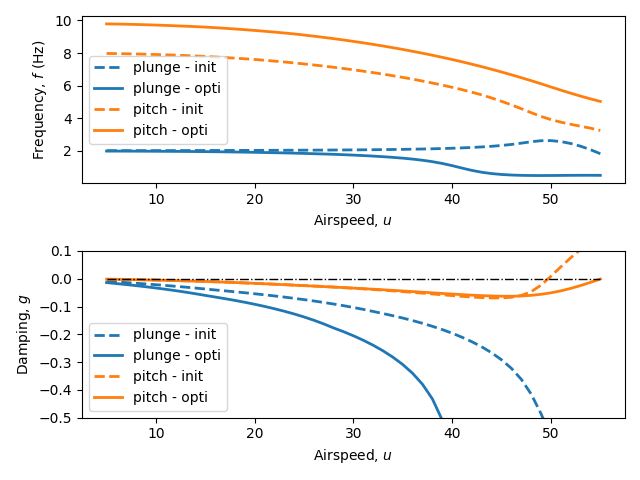

# 2dof-flutter
Flutter model of a 2D pitch-plunge flat plate in [OpenMDAO](https://openmdao.org/).  
Adrien Crovato, 2023.

## Demo

The first figure depitcs the flutter speed as a function of two design parameters, the thickness of the plate and the x-location of the torsion center. Blue dots indicate an instability of the plunge mode and orange dots indicate an instability of the pitch mode, while red dots indicate that flutter does not occur within the airspeed envelope.

An optimization problem was set up as follows:  
- minimize the mass of the plate  
- with respect to the plate thickness and the location of the torsion center  
- subject to no flutter occuring within the airspeed envelope  

The second figure depicts the initial and final values of the frequencies and dampings of the plunge and pitch modes. Initially, the torsion axis is located at `x/c = 0.5`, the plate is `t = 2` cm cm thick and it flutters at about `u = 50` m/s. After the optimization, the torsion axis is located at `x/c = 0.7`, the plate is `t = 1.4` cm thick and flutter has been pushed outside the envelope (flutter may still occurs at `u >= 55` m/s).
Comparing the results of the optimization to the parameter space displayed in the first figure shows that the gradient-based optimization was successfully driven in the right direction.
